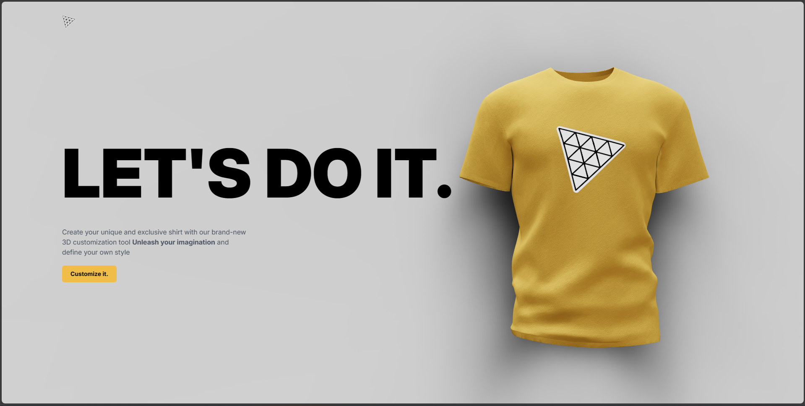
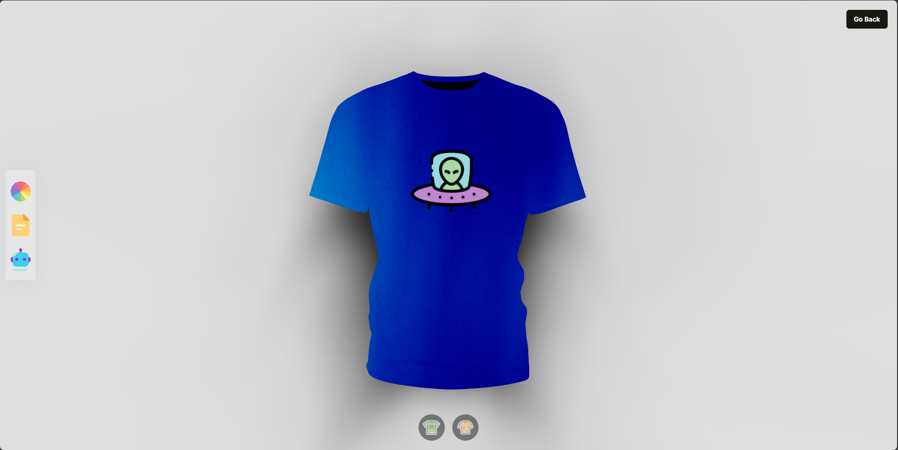

# ThreeJS
## 3D project using the library ThreeJS, as well as OpenAI API

In this project, you can generate a T-shirt unique to you using artificial intelligence or manually changing the color, texture and logo.

## Features

- Change the color of your T-shirt
- Add texture to your T-shirt
- Add a logo to your T-shirt
- Ask DALL·E to make a texture or logo for a T-shirt
- And watch the changes in real time in your computer/smartphone/tablet browser

## Tech

ThreeJS Project uses a number of open source projects to work properly:

- [React](https://react.dev/) - The library for web and native user interfaces
- [@react-three/drei](https://www.npmjs.com/package/@react-three/drei) - A growing collection of useful helpers and fully functional, ready-made abstractions for @react-three/fiber
- [@react-three/fiber](https://docs.pmnd.rs/react-three-fiber/getting-started/introduction) - Build your scene declaratively with re-usable, self-contained components that react to state, are readily interactive and can participate in React's ecosystem
- [framer-motion](https://www.framer.com/motion/introduction/) - Framer Motion is a simple yet powerful motion library for React.
- [maath](https://github.com/pmndrs/maath) - This is a collection of useful math helpers, random generators, bits and bobs.
- [react-color](https://www.npmjs.com/package/react-color) - A Collection of Color Pickers from Sketch, Photoshop, Chrome, Github, Twitter, Material Design & more
- [threejs](https://threejs.org/) - JavaScript 3D library
- [valtio](https://valtio-m4o5vdkjb-pmndrs.vercel.app/docs/introduction/getting-started) - Proxy state made simple
- [tailwindcss](https://tailwindcss.com/) - Rapidly build modern websites without ever leaving your HTML.
